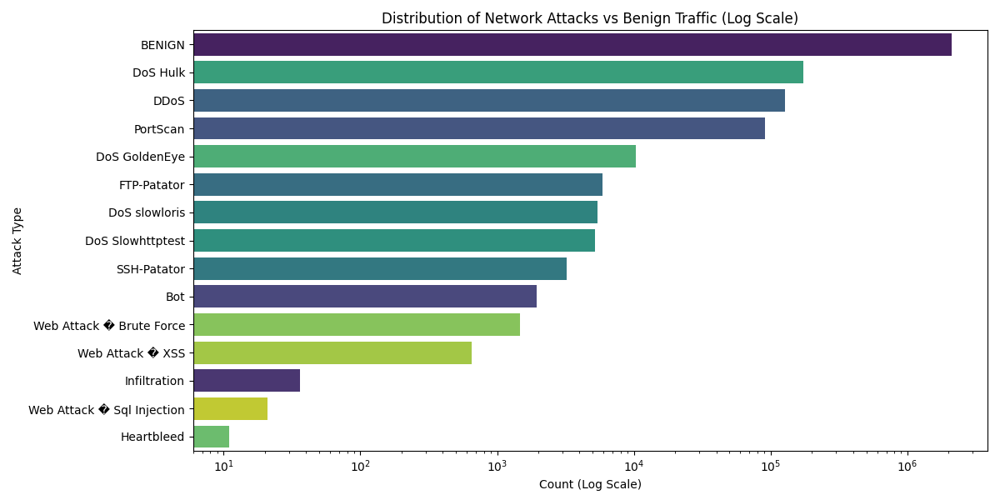

# 🔒 Neutron Sentinel: Deep Learning Network Intrusion Detection System (NIDS)

**Neutron Sentinel** is a high-performance, research-grade Intrusion Detection System built using the **CICIDS2017** dataset. It leverages an ensemble of Machine Learning models and Deep Learning architectures to detect, classify, and visualize network threats in real-time.

 *(Placeholder: Update with a real screenshot of your dashboard for the final Repo)*

---

## 🚀 Key Features

- **Multi-Class Classification**: Identifies 15 distinct traffic types including DDoS, PortScan, Botnets, and Web Attacks.
- **Anomaly Detection (Autoencoder)**: Uses an unsupervised reconstructive model to identify "zero-day" anomalies that deviate from Benign traffic patterns.
- **Real-Time Dashboard**: A modern, glassmorphic React interface with dynamic radar charts, health gauges, and server logs.
- **FastAPI Backend**: Asynchronous inference engine serving predictions at high frequency.
- **Balanced Intelligence**: Implements a sophisticated hybrid SMOTE-balancing pipeline to handle the extreme class imbalance inherent in cybersecurity data.

---

## 🏗️ System Architecture

The project follows a decoupled architecture for maximum performance and scalability:

1.  **The Engine (Python/Scikit-Learn)**: Processes multi-million row datasets, cleanses features, and builds optimized weight matrices.
2.  **The API (FastAPI)**: Acts as a bridge, loading the serialized models (`.pkl`) and the reconstruction thresholds to provide millisecond latency predictions.
3.  **The Watchtower (React/Vite)**: Visualizes the traffic profile, anomaly drift, and confidence levels across different model estimators.

---

## 🧠 Technical Details & Training Logic

### 1. Data Imbalance Resolution (The SMOTE Pipeline)
Intrusion detection datasets are notoriously imbalanced (e.g., millions of Benign flows vs. only dozens of Infiltration flows). To ensure the model doesn't just "guess Benign," we implemented a multi-stage balancing strategy:

- **Random UnderSampling (RUS)**: First, we cap the majority Benign class and large attack classes (like DoS Hulk) at **30,000 samples** each. This prevents OOM (Out of Memory) errors and reduces bias.
- **SMOTE (Synthetic Minority Over-sampling Technique)**: We then use K-nearest neighbors to synthetically generate new minority attack samples (like Heartbleed or Infiltration) until every class reaches **30,000 samples**.
- **Result**: A perfectly balanced dataset of **450,000 highly diverse samples**, ensuring the model learns the signatures of rare attacks as effectively as common ones.

### 2. The Model Ensemble
- **XGBoost & Random Forest**: Used as mathematical baselines. These handle high-dimensional tabular data with exceptional precision (>99% accuracy).
- **Deep Neural Network (MLP)**: A 3-layer dense architecture (128 -> 64 -> 32) using the **Adam Optimizer**. This captures non-linear relationships that traditional trees might miss.
- **Autoencoder (Deep Anomaly Detection)**: A bottleneck architecture trained *only* on Benign data. When an attack occurs, the "Reconstruction Error" (MSE) spikes, triggering the Anomaly Gauge even if the attack is previously unseen (Zero-Day).

---

## 🛠️ Installation & Setup

### Prerequisites
- Python 3.10+
- Node.js & npm

### 1. Backend Setup
```bash
# Clone the repository
git clone <your-repo-url>
cd network-intrusion-detection

# Install Python dependencies
pip install -r requirements.txt

# Start the FastAPI server
cd api
uvicorn main:app --reload
```

### 2. Frontend Setup
```bash
cd dashboard
npm install
npm run dev
```

---

## 📁 Project Structure

```text
├── api/                # FastAPI logic & inference endpoints
├── dashboard/          # React + Vite + Tailwind Frontend
├── data/               # (Ignored) Processed .pkl & .npy datasets
├── models/             # Serialized .pkl models & scaler
├── notebooks/          # EDA plots & research visualizations
├── src/                # Training scripts (SMOTE, DNN, EDA)
└── requirements.txt    # Project dependencies
```

---

## 📊 Evaluation Metrics
After SMOTE balancing, the models achieved the following performance on the full CICIDS2017 test set:

| Model | Accuracy | Type |
| :--- | :--- | :--- |
| **Random Forest** | 99.66% | Multi-Class |
| **XGBoost** | 99.74% | Multi-Class |
| **Deep Neural Net** | 96.60% | Deep Learning |
| **Autoencoder** | Threshold-based | Anomaly |

---

## 🛡️ License
Distributed under the MIT License. See `LICENSE` for more information.

---
**Developed with by Shyam and Sweatha — Neutron Sentinel Project**
